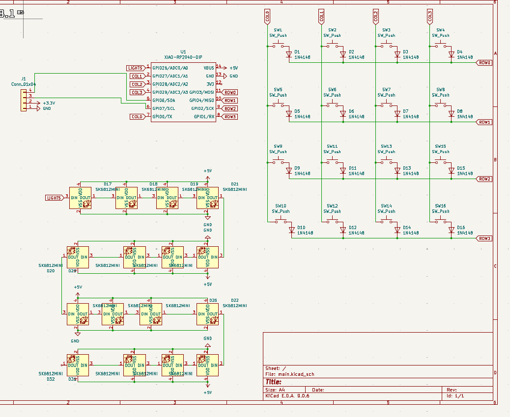
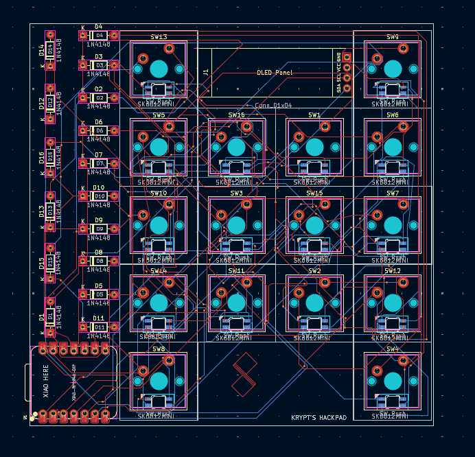
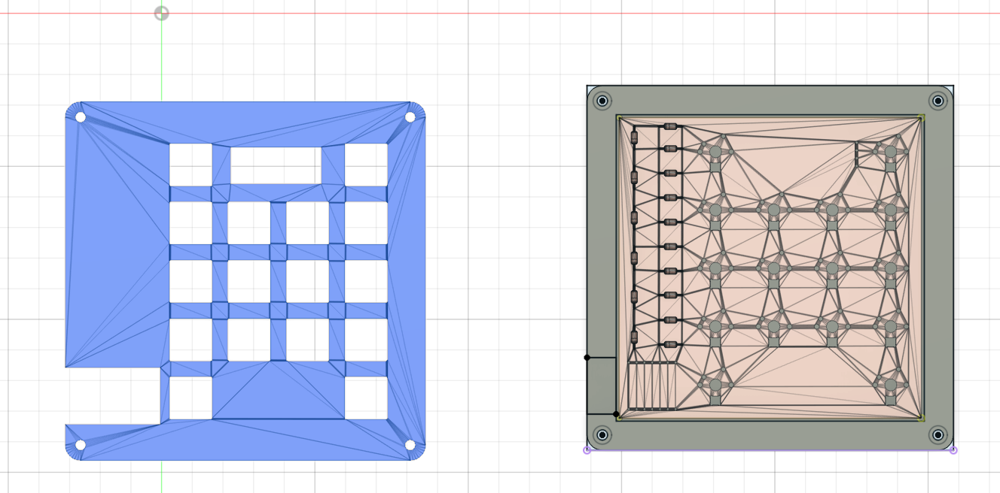

# KRYPT's Hackpad – Custom 4×4 KMK Macropad with OLED & RGB

A custom-designed 4×4 mechanical macropad built around the Seeed XIAO RP2040, featuring:

Matrix-scanned mechanical switches with diodes

SK6812 Mini RGB LEDs

0.91" OLED display

KMK firmware (CircuitPython)

PC-side system monitoring (CPU / RAM / GPU / Disk)

This project was designed as a DIY / competition-grade hackpad, from schematic → PCB → firmware → case.

# Project Images

  ## **Schematic**

  ## **PCB Layout**

  ## **Case & Assembly**

# Hardware Overview

MCU: Seeed Studio XIAO RP2040

Switches: MX-style mechanical switches

Matrix: 4 Rows × 4 Columns with 1N4148 diodes

RGB: SK6812 Mini (NeoPixel compatible)

Display: 0.91" OLED (SSD1306, 128×32)

Power: USB-C

# Pin Mapping
***Matrix***

**Columns**

COL0 → GPIO0

COL1 → GPIO27

COL2 → GPIO28

COL3 → GPIO29

**Rows**

ROW0 → GPIO3

ROW1 → GPIO4

ROW2 → GPIO2

ROW3 → GPIO1

**Peripherals**

RGB Data: GPIO26

OLED: I²C (default XIAO pins)

# Firmware

Keyboard firmware: KMK (CircuitPython)

Features:

Matrix scanning

RGB underglow

OLED display

USB HID data input from PC

#The OLED displays:

 CPU usage

 RAM usage

 GPU usage

 Disk (C:) usage

System statistics are sent from a PC-side Python script over USB HID.

# PC-side Software

A Python helper script runs on the host computer to:

Read system stats (via psutil, GPUtil)

Send data to the keyboard using HID

This architecture is similar to Stream Decks and professional macro pads.

# Author

Designed and built by kryptos

License

Open-sourse
